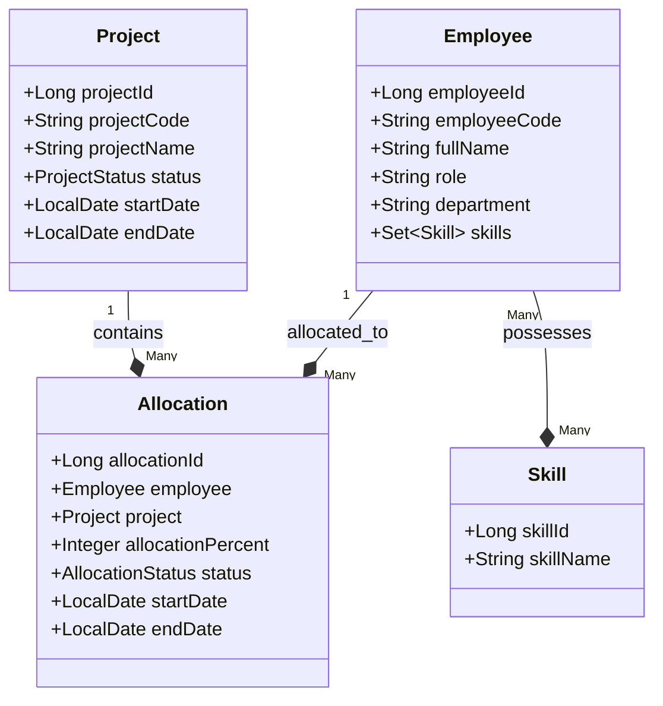

# Resource Allocation System (Backend)

> Hệ thống quản lý phân bổ nhân sự cho công ty outsourcing.  
> Xây dựng bằng **Spring Boot 3.x** (Java 17), **PostgreSQL**, **Flyway**, **Docker Compose**.

---

## Mô hình Nghiệp vụ & Thiết kế Hệ thống (Domain Model & Business Rules)

### 1. Bài toán thực tế dự án giải quyết (The Core Problem)
Đây là hệ thống Quản lý phân bổ nhân sự (Resource Allocation Management) thiết kế riêng cho mô hình các công ty Outsourcing/Gia công phần mềm hoặc Agency:
* **Thách thức của doanh nghiệp:** Làm sao để tối ưu hóa hiệu suất làm việc của nhân viên (không để ai quá rảnh rỗi - "bench"), nhưng đồng thời không để ai bị quá tải (dẫn đến stress, nghỉ việc), và khi có dự án mới thì nhanh chóng tìm được người có kỹ năng phù hợp còn đang rảnh để đưa vào dự án.

### 2. Mô hình Nghiệp vụ & Các Thực thể chính (Domain Model)
Sự tương tác giữa các thực thể được thể hiện qua sơ đồ quan hệ dưới đây:


* **Employee (Nhân viên):** Có kỹ năng (Skill) và thuộc về một phòng ban cụ thể.
* **Project (Dự án):** Có vòng đời trạng thái (PLANNING ➔ ACTIVE ➔ COMPLETED).
* **Allocation (Phân bổ - Thực thể giao dịch trung tâm):** Là cầu nối thể hiện việc Nhân viên A làm cho Dự án B với bao nhiêu phần trăm công lực (allocationPercent) trong khoảng thời gian nào.

### 3. Các Quy tắc Nghiệp vụ cốt lõi (Business Rules - Trọng tâm hệ thống)
Để tránh dữ liệu rác và sai sót vận hành, hệ thống áp dụng các luật cứng:
* **Quy tắc Tải trọng (Max Capacity Limit):**
  * Tổng số phần trăm phân bổ của một nhân viên trên tất cả các dự án đang chạy không được vượt quá 100%.
  * Chỉ các phân bổ ở trạng thái PENDING hoặc ACTIVE mới chiếm dung lượng. Phân bổ đã kết thúc (ENDED) sẽ được giải phóng tải trọng về 0%.
* **Ràng buộc trạng thái dự án (Project Status Constraint):**
  * Không được phép phân bổ nhân viên vào một dự án đã kết thúc (COMPLETED).
* **Ràng buộc xóa dữ liệu (Delete Safeguard):**
  * Không được xóa Nhân viên hoặc Dự án nếu họ đang có các phân bổ chưa kết thúc.
* **Vòng đời phân bổ (State Machine):**
  * Phân bổ đi theo luồng một chiều: PENDING (Chờ duyệt) ➔ ACTIVE (Đang làm) ➔ ENDED (Đã rút khỏi dự án).
  * Không cho phép quay ngược trạng thái (ví dụ: đã ENDED thì không được kích hoạt lại thành ACTIVE).

### 4. Các Tính năng chính giải quyết nhiệm vụ gì? (Key Features)
* **A. Quản lý Tải trọng thời gian thực (Workload Tracking):**
  * **API:** `GET /api/v1/employees/{id}/workload`
  * **Giải quyết:** Giúp Quản lý nhân sự (Resource Manager) biết nhân viên đó hiện tại đang làm những dự án nào, chiếm bao nhiêu % tải trọng (ví dụ: làm dự án A 60%, dự án B 40% = 100% overloaded) và còn bao nhiêu % rảnh rỗi để giao việc mới.
* **B. Tìm kiếm Nhân lực thông minh theo Kỹ năng (Resource Search):**
  * **API:** `GET /api/v1/employees/search?skill=Java`
  * **Giải quyết:** Khi dự án mới cần lập đội (staffing), PM chỉ cần gõ tên kỹ năng. Hệ thống sẽ lọc ra các lập trình viên có kỹ năng đó kèm theo dung lượng rảnh rỗi thực tế của họ tại thời điểm đó (ví dụ: Nguyen Van A - rảnh 40%).
* **C. Bộ báo cáo Vận hành (Operational Reports):**
  * **API:** `/api/v1/reports/utilization`, `/api/v1/reports/available`, `/api/v1/reports/overloaded`
  * **Giải quyết:**
    * Báo cáo nhân viên quá tải (>90%): Để kịp thời giảm tải trước khi họ kiệt sức (burnout).
    * Báo cáo nhân viên đang rỗi (>50% rảnh): Để nhanh chóng đào tạo hoặc điều động vào dự án mới nhằm giảm chi phí vận hành.
* **D. Trợ lý AI hỗ trợ ra quyết định (AI Assistant - Premium feature):**
  * **API:** `/api/v1/ai/recommend`, `/api/v1/ai/risk-detection`
  * **Giải quyết:**
    * Thay vì PM phải ngồi dò bảng báo cáo, PM có thể hỏi tự nhiên: "Tìm cho tôi lập trình viên Java còn rảnh trên 50%". AI sẽ phân tích DB thực tế và đề xuất người phù hợp nhất.
    * PM hỏi: "Dự án sắp tới bắt đầu, hãy phân tích rủi ro tải lượng". AI sẽ cảnh báo: "Có 3 nhân sự chủ chốt đang gánh 100% tải, nguy cơ trễ hạn sprint là rất cao".

---

## Yêu cầu hệ thống (Prerequisites)

* **Java 17+** (JDK 17 trở lên)
* **Docker Desktop** (để chạy PostgreSQL & pgAdmin)
* **Git** (quản lý phiên bản)
* **Node.js 18+** (nếu chạy cả FE — xem `resource_allocation_fe/README.md`)

---

## Hướng dẫn Thiết lập & Khởi chạy

Dự án hỗ trợ 2 phương pháp khởi chạy chính tùy theo nhu cầu phát triển:

### ⚠️ Lưu ý chung: Chuẩn bị file `.env` (Bắt buộc cho cả 2 cách)
Trước khi khởi chạy bằng bất kỳ cách nào, hãy tạo file `.env` từ file cấu hình mẫu:
1. Tại thư mục gốc `resource_allocation_be`, copy file `.env.example` thành `.env`:
   ```bash
   cp .env.example .env
   ```
2. Mở file `.env` vừa tạo và điền `GEMINI_API_KEY` của bạn nếu muốn sử dụng tính năng AI (nếu không có key, ứng dụng vẫn chạy bình thường và tự động dùng dữ liệu fallback từ database).

---

### Cách 1: Chạy nhanh toàn bộ hệ thống bằng Docker Compose (Khuyên dùng để demo/chạy thử)
Phương pháp này khởi chạy toàn bộ dịch vụ bao gồm PostgreSQL Database, pgAdmin và ứng dụng Spring Boot Backend bên trong container Docker.

1. **Khởi động toàn bộ stack:**
   Tại thư mục gốc `resource_allocation_be`, chạy lệnh:
   ```bash
   docker compose up --build -d
   ```
   *Lệnh này sẽ tự động build image cho backend Java và khởi chạy toàn bộ các dịch vụ dưới dạng chạy ngầm.*

2. **Truy cập các dịch vụ:**
   * **API Swagger UI:** [http://localhost:8080/swagger-ui.html](http://localhost:8080/swagger-ui.html)
   * **pgAdmin (Quản trị DB):** [http://localhost:5050](http://localhost:5050) (Đăng nhập bằng thông tin trong `.env`: `admin@company.com` / `admin123`).

3. **Dừng hệ thống:**
   ```bash
   docker compose down
   ```

---

### Cách 2: Chạy Backend dạng Local & Database bằng Docker (Khuyên dùng khi phát triển/code/debug)
Phương pháp này chỉ khởi động database PostgreSQL và pgAdmin trong Docker container, ứng dụng Java Spring Boot sẽ được khởi chạy trực tiếp trên máy của bạn (Local) để tiện sửa code và debug.

1. **Khởi động Database & pgAdmin:**
   Khởi chạy các container cơ sở dữ liệu ngầm bằng lệnh:
   ```bash
   docker compose up -d postgres pgadmin
   ```

2. **Đăng ký kết nối Database trên pgAdmin (Chỉ cần thực hiện lần đầu):**
   * Truy cập [http://localhost:5050](http://localhost:5050) và đăng nhập bằng tài khoản cấu hình trong `.env`.
   * Click chuột phải vào **Servers** -> **Register** -> **Server...**
   * Tab **General**: Điền tên tùy ý (ví dụ: `Resource Allocation Local`).
   * Tab **Connection**: Điền các thông tin kết nối sau:
     * **Host name/address:** `postgres` *(Lưu ý: Do pgAdmin chạy trong môi trường mạng Docker nên kết nối tới Database qua tên service nội bộ là `postgres`, không sử dụng `localhost`)*.
     * **Port:** `5432`
     * **Maintenance database:** `resource_allocation`
     * **Username:** `dev`
     * **Password:** `dev123`
   * Click **Save** để hoàn tất kết nối.

3. **Khởi chạy ứng dụng Spring Boot Backend:**

   * **Lựa chọn A: Chạy bằng IntelliJ IDEA / Eclipse (Khuyên dùng):**
     * Mở project bằng IDE của bạn.
     * Cài đặt plugin hỗ trợ đọc file `.env` (ví dụ: plugin `.env files support` trên IntelliJ) hoặc nạp thủ công các biến trong `.env` vào mục **Environment variables** trong phần cấu hình Run/Debug của ứng dụng.
     * Chạy hoặc debug trực tiếp class chính: `ResourceAllocationApplication.java`.

   * **Lựa chọn B: Chạy qua Command Line (Tự động nạp cấu hình từ `.env`):**
     * **Trên Windows (PowerShell):**
       ```powershell
       # Nạp các biến cấu hình từ file .env vào phiên làm việc
       Get-Content .env | ForEach-Object { $name, $value = $_.Split('=', 2); if ($name -and $value) { [Environment]::SetEnvironmentVariable($name.Trim(), $value.Trim(), "Process") } }
       # Khởi chạy ứng dụng
       .\mvnw.cmd spring-boot:run
       ```
     * **Trên Windows Command Prompt (CMD):**
       ```cmd
       set POSTGRES_DB=resource_allocation
       set POSTGRES_USER=dev
       set POSTGRES_PASSWORD=dev123
       set POSTGRES_PORT=5432
       set APP_PORT=8080
       set GEMINI_API_KEY=your-gemini-api-key
       .\mvnw.cmd spring-boot:run
       ```
     * **Trên Linux / macOS:**
       ```bash
       export $(cat .env | xargs) && ./mvnw spring-boot:run
       ```

---

## Kiểm tra Trạng thái Ứng dụng (Verification)

Sau khi ứng dụng khởi động thành công, bạn có thể kiểm tra qua các URL sau:

| Dịch vụ | URL truy cập | Thông tin bổ sung |
| :--- | :--- | :--- |
| **Ứng dụng API** | `http://localhost:8080` | |
| **Kiểm tra trạng thái (Health Check)** | [http://localhost:8080/actuator/health](http://localhost:8080/actuator/health) | Trả về `{"status":"UP"}` nếu chạy tốt |
| **Tài liệu API (Swagger UI)** | [http://localhost:8080/swagger-ui.html](http://localhost:8080/swagger-ui.html) | Dùng để thử nghiệm các endpoint API |
| **Trình quản lý DB (pgAdmin)** | [http://localhost:5050](http://localhost:5050) | Đăng nhập mặc định: `admin@company.com` / `admin123` |

---

## Cấu trúc thư mục chính (Key Project Structure)

```
com.company.resourceallocation
├── core                      # Module nghiệp vụ chính
│   ├── employee              #   Employee CRUD
│   │   ├── controller        #     REST Controller
│   │   ├── service           #     Business Service
│   │   ├── repository        #     Spring Data JPA Repository
│   │   ├── entity            #     JPA Entity
│   │   ├── mapper            #     MapStruct Mapper
│   │   ├── exception         #     Domain Exceptions
│   │   └── dto               #     DTOs
│   ├── project               #   Project CRUD
│   │   ├── controller
│   │   ├── service
│   │   ├── repository
│   │   ├── entity
│   │   ├── mapper
│   │   ├── exception
│   │   └── dto
│   └── allocation            #   Allocation (phân bổ)
│       ├── controller
│       ├── service
│       ├── repository
│       ├── entity
│       ├── mapper
│       ├── exception
│       └── dto
├── report                    # Báo cáo (utilization, available, overloaded)
├── ai                        # AI Bonus (Gemini integration)
├── exception                 # GlobalExceptionHandler + custom exceptions
├── aspect                    # AOP Logging
└── config                    # OpenAPI / Swagger config
```

---

## Seed Data

Hệ thống tự động khởi tạo dữ liệu mẫu thông qua các script **Flyway migration** (`V2__seed_data.sql` và `V3__add_skills_and_allocation_status.sql`):

| Employee | Skills | Capacity Load | Allocations & Statuses |
|---|---|---|---|
| **EMP001 - Nguyen Van A** | Java, Spring Boot, PostgreSQL | **100%** | PRJ001 (60% `ACTIVE`), PRJ002 (40% `PENDING`) |
| **EMP002 - Tran Thi B** | Java, Docker | **80%** | PRJ001 (80% `ACTIVE`) |
| **EMP003 - Le Van C** | React, TypeScript | **0%** (Do đã ENDED) | PRJ001 (40% `ENDED` - Loại khỏi tải trọng) |
| **EMP004 - Pham Van D** | Chưa gán | **0%** | Chưa phân bổ |

| Project | Status |
|---|---|
| **PRJ001 - E-Commerce Platform** | ACTIVE |
| **PRJ002 - Internal Dashboard** | PLANNING |
| **PRJ003 - Legacy Upgrade** | COMPLETED |
